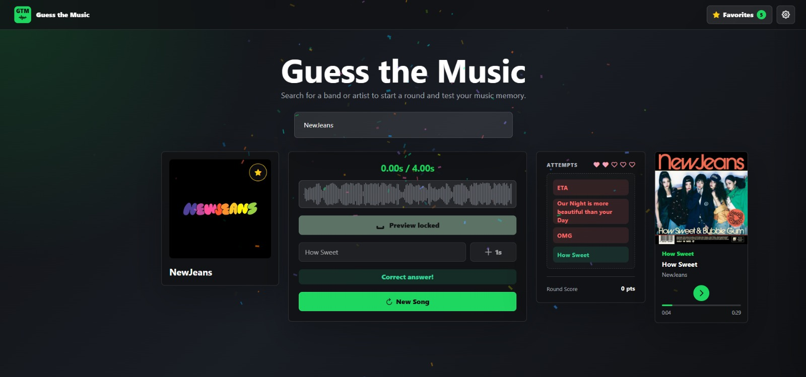
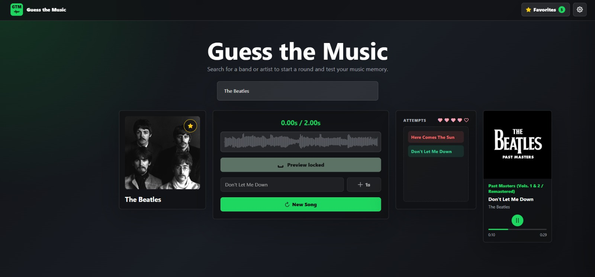
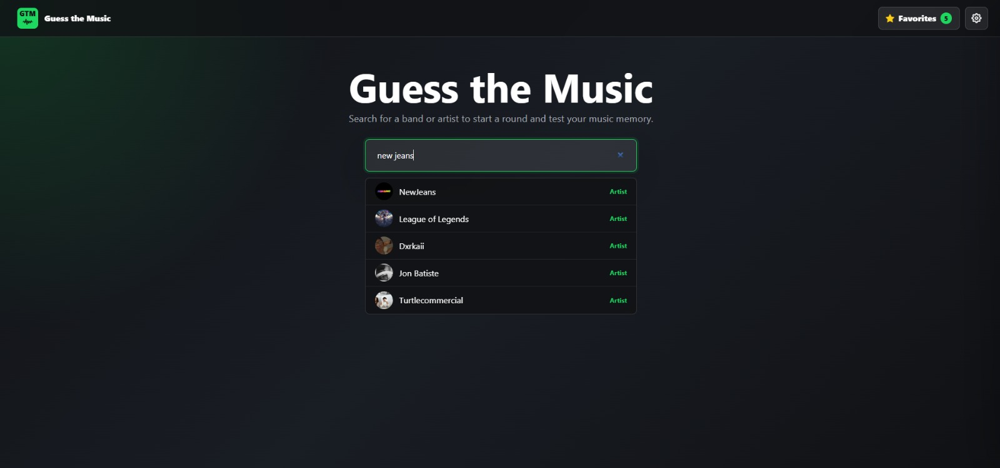
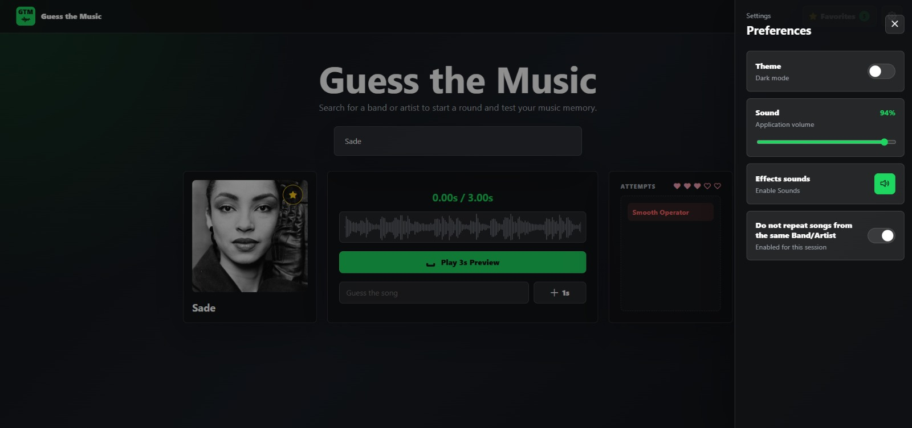
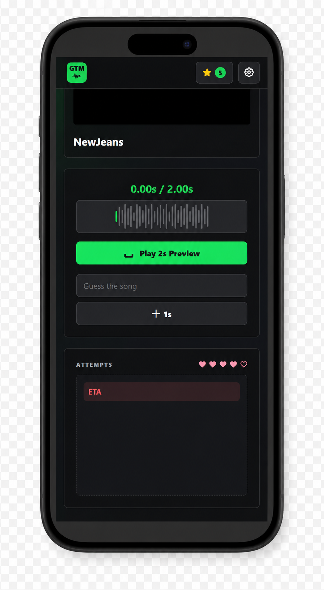

# Guess the Music Game

React + Vite application for a music guessing game.

## Initial Stack

- React
- Vite
- Axios
- Responsive CSS

## How to Run

```bash
npm install
npm run dev
```

The project runs by default at `http://localhost:5173`.

To run with the serverless API locally, use the Vercel CLI:

```bash
npx vercel dev
```

## Prints











## Scripts

```bash
npm run dev
npm run build
npm run lint
npm run preview
```

## Deezer API

The frontend calls the serverless proxy at `/api/deezer`. The RapidAPI key stays only in the serverless environment, never in the browser bundle.

To configure it, create a `.env.local` file from `.env.example` or add the variables in the Vercel dashboard:

```txt
DEEZER_API_URL=https://deezerdevs-deezer.p.rapidapi.com
DEEZER_API_HOST=deezerdevs-deezer.p.rapidapi.com
RAPIDAPI_KEY=your_rapidapi_key_here
```

Do not use `VITE_RAPIDAPI_KEY`: variables with the `VITE_` prefix are published in the frontend JavaScript.
